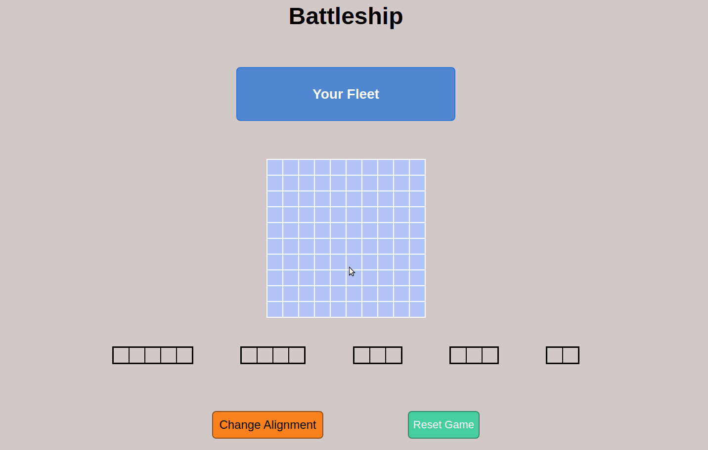

<h1> Battleship </h1>

<h2>Brief Introduction </h2>

Web application that implements the famous game 'Battleship'.  This project encapsulates and ingrains my research on Test Driven Development as I incorporate unit testing throughout the project building process to gain a deeper understanding of it.  This will be the final project using vanilla JS, and will serve as a substantial final practice for DOM manipulation before moving on to ReactJS.

<h2>Skills Demonstrated</h2>

The skills I aim to raise and develop during this project are mainly my skills in TDD.  By getting used to building unit tests in Jest for functions that run in the back-end of this project, it will further improve my abilities to build modular and cleaner code.  Furthermore, it gives me a chance to practice building pure functions, and lastly it helps me master DOM manipulation.

<h2>Challenges I Faced</h2>

Challenges on this project I had dealt with were getting used to Jest, changing my approach to coding, and connecting the ships on the game board with the ship objects.  Firstly, the challenges I had with Jest was getting used with the program and being able to tell the program what output I am looking for.  Telling the program to look for string outputs was simple enough, I had to spend a bit of time learning how to check arrays and objects that are stored in 2D arrays through Jest.  Secondly, instead of coding right away, I had to change my approach and think about what the result should be, and then create code that satisfies that result.  This 'green light, red light' approach turned out to be fun!  Lastly, I had some troubles trying to decide how to connect the shots landed on the board on the webpage, to the board stored in an array in the back-end.  After spending some time on how to approach the logic, I was satisfied with what I was able to come up with.

## Available Scripts

In the project directory, you can run:

### `npm start`

Runs the app in the development mode.\
Open [http://localhost:3000](http://localhost:3000) to view it in the browser.

The page will reload if you make edits.\
You will also see any lint errors in the console.

### `npm test`

Launches the test runner in the interactive watch mode.\
See the section about [running tests](https://facebook.github.io/create-react-app/docs/running-tests) for more information.

### `npm run build`

Builds the app for production to the `build` folder.\
It correctly bundles React in production mode and optimizes the build for the best performance.

The build is minified and the filenames include the hashes.\
Your app is ready to be deployed!

See the section about [deployment](https://facebook.github.io/create-react-app/docs/deployment) for more information.

### `npm run eject`

**Note: this is a one-way operation. Once you `eject`, you can’t go back!**

If you aren’t satisfied with the build tool and configuration choices, you can `eject` at any time. This command will remove the single build dependency from your project.

Instead, it will copy all the configuration files and the transitive dependencies (webpack, Babel, ESLint, etc) right into your project so you have full control over them. All of the commands except `eject` will still work, but they will point to the copied scripts so you can tweak them. At this point you’re on your own.

You don’t have to ever use `eject`. The curated feature set is suitable for small and middle deployments, and you shouldn’t feel obligated to use this feature. However we understand that this tool wouldn’t be useful if you couldn’t customize it when you are ready for it.

## Learn More

You can learn more in the [Create React App documentation](https://facebook.github.io/create-react-app/docs/getting-started).

To learn React, check out the [React documentation](https://reactjs.org/).

### Code Splitting

This section has moved here: [https://facebook.github.io/create-react-app/docs/code-splitting](https://facebook.github.io/create-react-app/docs/code-splitting)

### Analyzing the Bundle Size

This section has moved here: [https://facebook.github.io/create-react-app/docs/analyzing-the-bundle-size](https://facebook.github.io/create-react-app/docs/analyzing-the-bundle-size)

### Advanced Configuration

This section has moved here: [https://facebook.github.io/create-react-app/docs/advanced-configuration](https://facebook.github.io/create-react-app/docs/advanced-configuration)

### Deployment

This section has moved here: [https://facebook.github.io/create-react-app/docs/deployment](https://facebook.github.io/create-react-app/docs/deployment)

### `npm run build` fails to minify

This section has moved here: [https://facebook.github.io/create-react-app/docs/troubleshooting#npm-run-build-fails-to-minify](https://facebook.github.io/create-react-app/docs/troubleshooting#npm-run-build-fails-to-minify)

<h2>How to Play</h2>

DRAG ship pieces on the board, when all pieces are on the board a start button will appear.

START the game by clicking the button.

CLICK on spaces on your opponents board to try and attack their ships.  hits are registered as red, and misses as grey.  Game ends when all ships on either board are wiped out.

<h2>Live Demo</h2>

https://ramankala.github.io/battleship/

